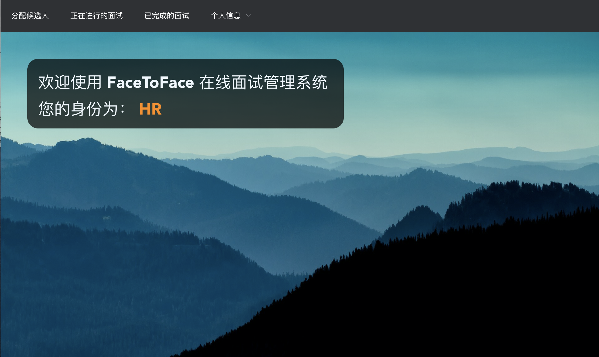
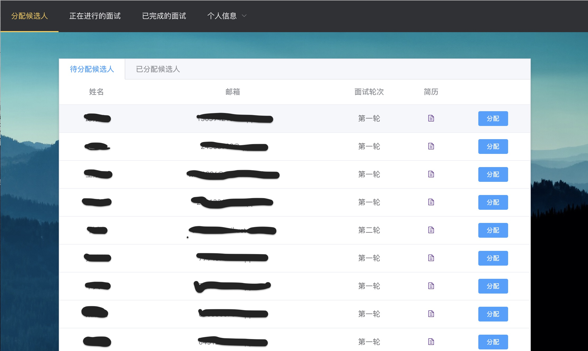
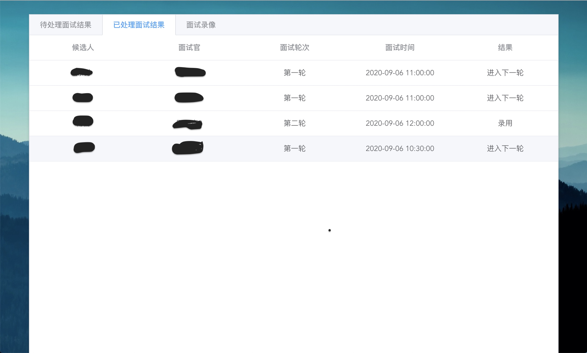

# FaceToFace Online Interview Platform

2020春USTC软件工程项目实践，完成一个在线面试平台。

其中管理系统后端以及数据库部分绝大部分由我编写，其他的由小伙伴编写。

面试平台前端：Vue 

管理系统前端：Vue 后端：Spring+SpringBoot  数据库:MySQL 

管理系统的部署：将管理系统前端中的接口路径改成你自己的，(如我部署在catchersun.cn服务器上，我的默认路径为https://catchersun.cn:XXXX) ；再build成dist包，将其中内容完全拷贝到后端的resources文件夹中；将后端源代码中发送邮件部分发送内容中面试平台的地址改成面试平台前端地址；再将application.yml中的数据库有关改成你自己的。然后使用Maven打包成Jar包，上传到服务器。注意，服务器需要支持https,需要将后端中有关静态文件改成你自己的。服务器商一般有对应的设置指南。

面试平台前端部署：直接运行Vue 文件，参见对应文件夹中Readme.md。同样注意修改对应接口路径：向管理系统对应的服务器上传送面试评价等。

登录之后：（数据库中默认HR的用户名以及密码均为admin)

分配成功之后会发送邮件给面试官和面试者。

