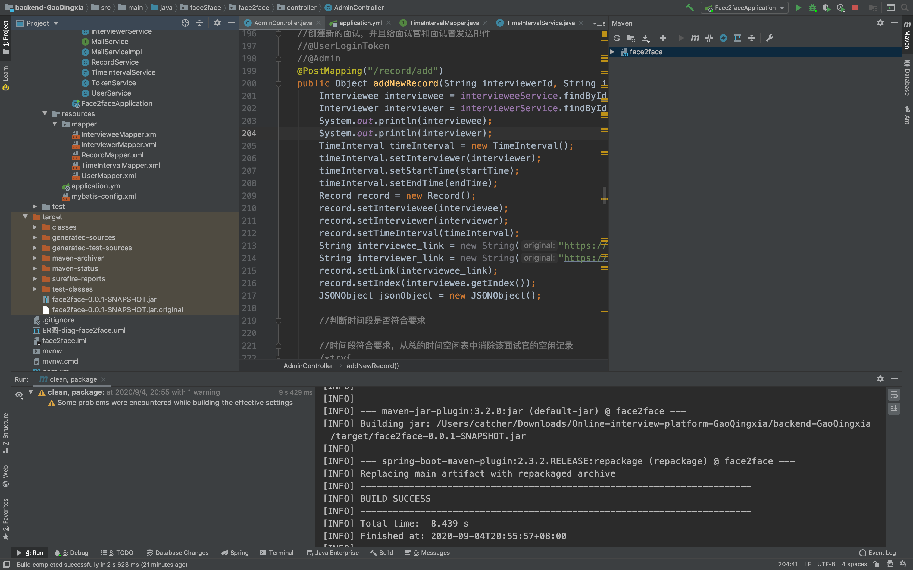

后端部署：

- 服务器中导入数据库文件两个

- （以下默认在安装了IntelliJ环境下执行）将application中的数据库密码改成你自己的
- 命令行输入`mvn clean package`，将项目打包成jar包

- 左边target中可以看到一个jar包，我们可以对它重新命名
- 将jar包上传到服务器中
- 在jar包存放的位置新建文件nohup.out作为日志，将在服务器不间断运行的情况下记录项目的控制台输出
- 命令行输入 `nohup nohup java -jar XXX.jar & `,XXX是项目jar包的名字
- 若无BUG，部署完毕。

